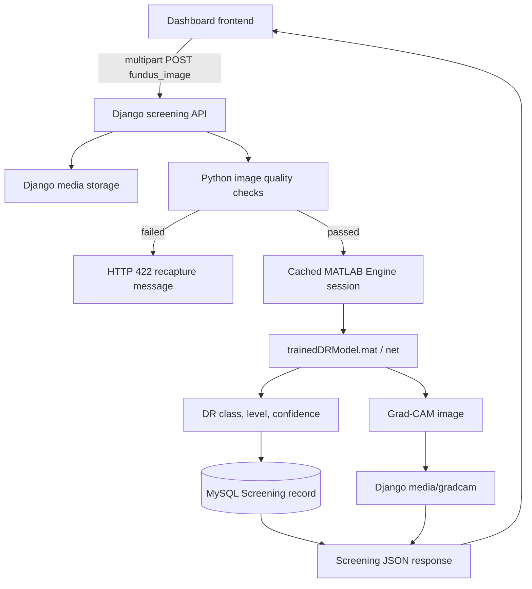

# PHC Diabetic Retinopathy Screening System

## 1. Purpose

This project is a Django-based rural Primary Health Centre screening application for diabetic retinopathy. A PHC worker uploads a fundus image, enters patient information, and submits the case for prototype AI screening.

The application connects Django to the existing MATLAB R2026a model:

```text
C:\SIH HACKThon\DR_Project\trainedDRModel.mat
```

The MATLAB model is a ResNet-18-based five-class classifier. It is used without retraining, conversion, or replacement.

This is a research prototype and screening-support tool. It must not be described as a clinically validated diagnostic system. Final clinical assessment must be performed by a qualified ophthalmologist.

## 2. Current Architecture



The current project is a single Django project and one Django application:

```text
phc_screening/
├── manage.py
├── requirements.txt
├── media/
│   ├── fundus/
│   └── gradcam/
├── phc_screening/
│   ├── settings.py
│   ├── urls.py
│   ├── wsgi.py
│   └── asgi.py
├── screening/
│   ├── models.py
│   ├── views.py
│   ├── urls.py
│   ├── forms.py
│   ├── backends.py
│   ├── migrations/
│   ├── templates/
│   └── static/
├── ai_engine/
│   ├── __init__.py
│   ├── matlab_engine.py
│   ├── predictor.py
│   ├── quality.py
│   └── matlab/
│       └── screen_fundus.m
└── docs/
    └── PROJECT_DOCUMENTATION.md
```

Django REST Framework is not currently used. The screening API uses Django views and `JsonResponse`.

## 3. Main Request Flow

### 3.1 User action

The PHC worker opens the dashboard and selects **Screen New Patient**.

The modal collects:

- Patient full name
- Age
- Gender
- Diabetes duration
- HbA1c
- Examined eye side
- Fundus image

The frontend uses `FormData` so the image can be uploaded as multipart form data.

The browser sends the form to:

```text
POST /api/create_screening/
```

The JavaScript implementation is in:

[screening/templates/dashboard.html](../screening/templates/dashboard.html)

The upload input is defined in:

[screening/templates/modals/new_screening_modal.html](../screening/templates/modals/new_screening_modal.html)

### 3.2 Django receives the request

The endpoint is defined in:

[screening/urls.py](../screening/urls.py)

and implemented in:

[screening/views.py](../screening/views.py)

The uploaded file is read from:

```python
request.FILES.get('fundus_image')
```

The endpoint requires:

```text
fundus_image
```

Supported image extensions:

- `.jpg`
- `.jpeg`
- `.png`

Maximum upload size:

```text
10 MB
```

Django stores accepted fundus images under:

```text
media/fundus/
```

The binary image is not stored inside MySQL. MySQL stores the Django `ImageField` path.

### 3.3 Quality check

Before MATLAB inference, Django copies the upload to a temporary file and calls:

```python
check_image_quality(image_path)
```

Implementation:

[ai_engine/quality.py](../ai_engine/quality.py)

The prototype calculates:

- Image readability using Pillow
- Sharpness using a Laplacian variance estimate
- Average grayscale brightness
- Field-of-view percentage using a brightness mask
- Image width and height

Current prototype thresholds:

| Check | Rule |
|---|---|
| Extension | JPG, JPEG, or PNG |
| File size | Maximum 10 MB |
| Sharpness | Must be at least `5` |
| Brightness | Must be between `40` and `220` |
| Field of view | Must be at least `20%` |

If a check fails:

- MATLAB is not started or called.
- No `Patient` or `Screening` record is created.
- Django returns HTTP `422`.
- The response includes an error message and quality metrics.

Example:

```json
{
  "error": "Image appears blurred. Please recapture it in focus.",
  "quality_metrics": {
    "sharpness": 2.14,
    "brightness": 80.3,
    "field_of_view_percent": 72.1,
    "width": 1500,
    "height": 1000
  }
}
```

These are prototype capture-quality checks. They are not clinical validation or a guarantee that an image is suitable for diagnosis.

## 4. MATLAB Integration

### 4.1 Model location

The configured model path is:

```text
C:\SIH HACKThon\DR_Project\trainedDRModel.mat
```

Django reads the path from the `MATLAB_MODEL_PATH` environment variable when provided. Otherwise it uses the path configured in:

[phc_screening/settings.py](../phc_screening/settings.py)

The model file contains the MATLAB variable:

```matlab
net
```

The MATLAB project was inspected and confirmed to use:

```matlab
load('trainedDRModel.mat', 'net');
```

### 4.2 MATLAB Engine lifecycle

The Python adapter is:

[ai_engine/matlab_engine.py](../ai_engine/matlab_engine.py)

The first screening request:

1. Imports `matlab.engine`.
2. Starts MATLAB using `matlab.engine.start_matlab()`.
3. Adds the project MATLAB helper directory to the MATLAB path.
4. Calls the helper function.

A module-level singleton and lock are used so the MATLAB Engine is started once per Django Python process instead of once per request.

The MATLAB helper also uses a MATLAB `persistent` variable:

```matlab
persistent net loadedModelFile;
```

Therefore, the `.mat` model is loaded once per MATLAB Engine session. Later requests reuse the loaded network.

### 4.3 MATLAB helper

The MATLAB function is:

[ai_engine/matlab/screen_fundus.m](../ai_engine/matlab/screen_fundus.m)

Django calls it conceptually as:

```python
engine.screen_fundus(
    model_path,
    image_path,
    gradcam_output_path,
    nargout=6,
)
```

The MATLAB function performs these steps:

1. Load `net` from `trainedDRModel.mat` if it is not already cached.
2. Read the uploaded image.
3. Read the model input size from `net.Layers(1).InputSize`.
4. Resize the image to the model input size.
5. Convert it to single precision.
6. Convert it to an `SSC` `dlarray`.
7. Call `predict(net, patientInput)`.
8. Extract model scores.
9. Apply `softmax`.
10. Select the highest-probability class.
11. Convert the class to DR level `0` through `4`.
12. Generate Grad-CAM.
13. Save the Grad-CAM image.

The existing MATLAB Grad-CAM configuration is preserved:

```matlab
FeatureLayer="res5b_relu"
ReductionLayer="prob"
```

The MATLAB helper generates a non-interactive figure, overlays the score map, and saves the result under Django media storage.

## 5. Prediction Mapping

The model classes are mapped as follows:

| MATLAB class | DR level | Meaning |
|---|---:|---|
| `No_DR` | 0 | No diabetic retinopathy |
| `Mild` | 1 | Mild DR |
| `Moderate` | 2 | Moderate DR |
| `Severe` | 3 | Severe DR |
| `Proliferate_DR` | 4 | Proliferative DR |

The Python prediction service is:

[ai_engine/predictor.py](../ai_engine/predictor.py)

It returns normalized data:

```json
{
  "predicted_class": "Moderate",
  "dr_level": 2,
  "confidence": 30.65,
  "referable": true,
  "referral_urgency": "priority",
  "low_confidence": true,
  "gradcam_path": "C:\\htm\\phc_screening\\media\\gradcam\\fundus_gradcam.png"
}
```

The confidence is the highest softmax probability multiplied by `100`.

Low confidence rule:

```text
confidence < 50% => low_confidence = true
```

Referable DR rule:

```text
dr_level >= 2 => referable = true
```

Referral mapping:

| DR level | Referral urgency |
|---:|---|
| 0 | `routine` |
| 1 | `routine` |
| 2 | `priority` |
| 3 | `urgent` |
| 4 | `urgent` |

No microaneurysm, hemorrhage, exudate, or edema counts are invented. The ResNet classifier returns class probabilities; it does not automatically produce lesion counts.

## 6. Database Models

The models are defined in:

[screening/models.py](../screening/models.py)

### Patient

Stores:

- Name
- Patient ID
- Age
- Gender
- Diabetes duration
- HbA1c
- Created timestamp

`diabetes_duration` is a decimal field because the UI accepts values such as `1.5` years.

### Screening

Stores:

- Patient relationship
- Eye side
- Original fundus image path
- Grad-CAM image path
- Predicted class
- DR level
- Existing display diagnosis
- Confidence
- Referable status
- Low-confidence status
- Quality pass status
- Quality metrics JSON
- Quality message
- Clinical findings JSON
- Referral urgency
- Referral generated status
- Screening timestamp

The AI fields were added in:

[screening/migrations/0003_screening_dr_level_screening_gradcam_image_and_more.py](../screening/migrations/0003_screening_dr_level_screening_gradcam_image_and_more.py)

The decimal diabetes-duration change was added in:

[screening/migrations/0004_alter_patient_diabetes_duration.py](../screening/migrations/0004_alter_patient_diabetes_duration.py)

### Media storage

```text
media/fundus/       Original uploaded fundus images
media/gradcam/      Generated Grad-CAM images
```

The project currently serves media files during development through:

[phc_screening/urls.py](../phc_screening/urls.py)

Production deployments should serve media through a properly configured web server or object storage.

## 7. API Contract

### Create screening

```text
POST /api/create_screening/
Content-Type: multipart/form-data
```

Required form fields:

```text
patientName
age
gender
diabetes_duration
hba1c
eye_side
fundus_image
```

The endpoint also creates an internal patient ID in the frontend and sends it as `patient_id`.

Successful response example:

```json
{
  "id": 16,
  "patient_id": "PAT-DECIMAL-TEST",
  "image_url": "/media/fundus/fundus_example.jpg",
  "gradcam_url": "/media/gradcam/fundus_example_gradcam.png",
  "predicted_class": "Moderate",
  "dr_level": 2,
  "confidence": 30.65,
  "referable": true,
  "referral_urgency": "priority",
  "referral_urgency_display": "Priority (3–4 Weeks)",
  "low_confidence": true
}
```

Possible responses:

| Status | Meaning |
|---:|---|
| 200 | Screening saved and MATLAB result returned |
| 400 | Invalid request, MATLAB error, database error, or missing data |
| 401/302 | User is not authenticated |
| 405 | HTTP method is not POST |
| 422 | Image failed quality validation |

### List patients

```text
GET /api/patients/
```

Requires authentication.

### Get latest screening for a patient

```text
GET /api/screening/<patient_id>/
```

Returns patient data, prediction, quality data, original image URL, and Grad-CAM URL.

### Generate referral

```text
GET /api/referral/<screening_id>/
```

Requires authentication. The current implementation returns a referral message and slip number. PDF generation is not currently implemented.

## 8. Authentication

Authentication routes are defined in:

[screening/urls.py](../screening/urls.py)

Routes:

```text
/register/
/login/
/logout/
```

The custom authentication backend supports username, email, and phone-number login:

[screening/backends.py](../screening/backends.py)

The dashboard and screening APIs use `login_required`.

The navigation bar is rendered for authenticated users in:

[screening/templates/base.html](../screening/templates/base.html)

Registration and login pages use:

```text
screening/templates/base_no_nav.html
screening/templates/registration/login.html
screening/templates/registration/register.html
```

## 9. Installation and Configuration

### 9.1 Python environment

Use the environment that contains both Django dependencies and MATLAB Engine:

```powershell
cd C:\htm\phc_screening
.\venv\Scripts\Activate.ps1
```

Verify the interpreter:

```powershell
python -c "import sys; print(sys.executable)"
```

It should point to:

```text
C:\htm\phc_screening\venv\Scripts\python.exe
```

### 9.2 Install project dependencies

```powershell
python -m pip install -r requirements.txt
```

### 9.3 Install MATLAB Engine for Python

MATLAB R2026a provides the Engine package here:

```text
C:\Program Files\MATLAB\R2026a\extern\engines\python
```

The standard installation command is:

```powershell
python -m pip install "C:\Program Files\MATLAB\R2026a\extern\engines\python"
```

On this Windows installation, the MATLAB folder is protected and the package build may need a writable temporary layout that preserves these relative directories:

```text
<temporary-root>\bin\win64
<temporary-root>\extern\bin\win64
<temporary-root>\extern\engines\python
```

After installation, verify:

```powershell
python -c "import matlab.engine; print('MATLAB Engine OK')"
```

### 9.4 Configure the model path

The default path is already configured for this project:

```text
C:\SIH HACKThon\DR_Project\trainedDRModel.mat
```

To override it for another machine:

```powershell
$env:MATLAB_MODEL_PATH = 'D:\models\trainedDRModel.mat'
```

The file must exist and contain a MATLAB variable named `net`.

### 9.5 Database migrations

```powershell
python manage.py migrate
```

Check the project:

```powershell
python manage.py check
```

### 9.6 Start Django

Always start Django with the same environment where MATLAB Engine is installed:

```powershell
venv\Scripts\python.exe manage.py runserver 127.0.0.1:8000
```

Open:

```text
http://127.0.0.1:8000/login/
```

## 10. Real-Time Request Behavior

The current implementation is synchronous.

For each accepted screening request:

1. Browser uploads the image.
2. Django writes the uploaded image to media storage.
3. Python checks image quality.
4. Django calls the already-running MATLAB Engine.
5. MATLAB predicts the class.
6. MATLAB generates Grad-CAM.
7. Django saves the database record.
8. Django returns JSON.
9. The dashboard reloads the patient list and displays the result.

The first request in a Django worker is slower because it starts MATLAB and loads the network. Later requests in the same worker reuse the Engine and cached MATLAB network.

There is currently no background task queue. The HTTP request remains open while MATLAB runs. For production or high-volume use, the inference operation should be moved to a worker system such as Celery or a dedicated inference service.

The Django development server is not suitable for production MATLAB inference workloads. Multiple worker processes would each have their own MATLAB Engine and loaded model.

## 11. Frontend Result Behavior

The dashboard is implemented in:

[screening/templates/dashboard.html](../screening/templates/dashboard.html)

After a successful screening:

1. The modal closes.
2. The patient list reloads.
3. The new patient becomes active.
4. The original uploaded image is displayed.
5. The diagnosis panel displays the returned DR class and confidence.
6. The referable status is shown.
7. The referral urgency is shown.
8. The Grad-CAM URL is loaded into the Grad-CAM tab.
9. The referral slip uses values returned from the database.

The frontend no longer submits hardcoded diagnosis, confidence, referral, or lesion-count values.

## 12. Error Handling and Troubleshooting

### MATLAB Engine not installed

Error:

```text
MATLAB Engine for Python is not installed
```

Fix:

```powershell
venv\Scripts\python.exe -c "import matlab.engine; print('OK')"
```

If this fails, install the Engine package into the exact environment used by Django.

### Wrong Python environment

Check the running server process and interpreter. Do not mix `.venv`, `venv`, and the Windows Store Python interpreter.

Use:

```powershell
venv\Scripts\python.exe manage.py runserver
```

### Model not found

Check:

```powershell
Test-Path 'C:\SIH HACKThon\DR_Project\trainedDRModel.mat'
```

Or set:

```powershell
$env:MATLAB_MODEL_PATH = 'C:\path\to\trainedDRModel.mat'
```

### Grad-CAM layer error

The helper expects these exact model layers:

```matlab
res5b_relu
prob
```

If the saved network does not expose those names, prediction may work but Grad-CAM will fail. The model architecture must be inspected in MATLAB before changing the helper.

### Quality rejection

HTTP `422` means the image failed the prototype quality gate. The response contains the measured metrics and recapture message.

### Fractional diabetes duration

Values such as `1.5` are supported. The database field is a decimal field with one decimal place.

### Database errors

Confirm that MySQL is running, `phc_db` exists, and the Django database settings are correct.

## 13. Security and Production Notes

Current protections include:

- Login protection on dashboard and API endpoints
- CSRF protection for the upload endpoint
- File extension validation
- File size validation
- Pillow readability validation
- No external AI API calls
- No API key for MATLAB
- No image binary stored in MySQL

The current local `settings.py` still contains a hardcoded Django secret key and database password. Before deployment, move these values into environment variables or a `.env` file and add `.env` to `.gitignore`.

Additional production work should include:

- `DEBUG = False`
- Explicit production `ALLOWED_HOSTS`
- Secure cookies and HTTPS
- Rate limiting
- Antivirus/content scanning for uploads
- Restricted media access
- Database backups
- MATLAB Engine process supervision
- Background inference jobs
- Audit logging
- Clinical review workflow
- Model version tracking
- Validated quality thresholds
- Formal clinical validation

## 14. Validation Performed

The implemented integration has been tested with the supplied model and sample fundus image.

Observed output:

```json
{
  "predicted_class": "Moderate",
  "dr_level": 2,
  "confidence": 30.65,
  "referable": true,
  "referral_urgency": "priority",
  "low_confidence": true
}
```

The sample image also produced a Grad-CAM file under:

```text
media/gradcam/
```

Validated commands:

```powershell
python manage.py check
python manage.py makemigrations --check --dry-run
python -c "import matlab.engine"
```

A multipart API request was also tested with a fractional diabetes duration of `1.5` years and completed successfully.

## 15. Important Clinical Disclaimer

The MATLAB model reports a research-prototype classification and confidence score. The result is not a final diagnosis. A low-confidence result requires manual clinical review, and every referable result should be reviewed by an ophthalmologist according to the clinical workflow.
